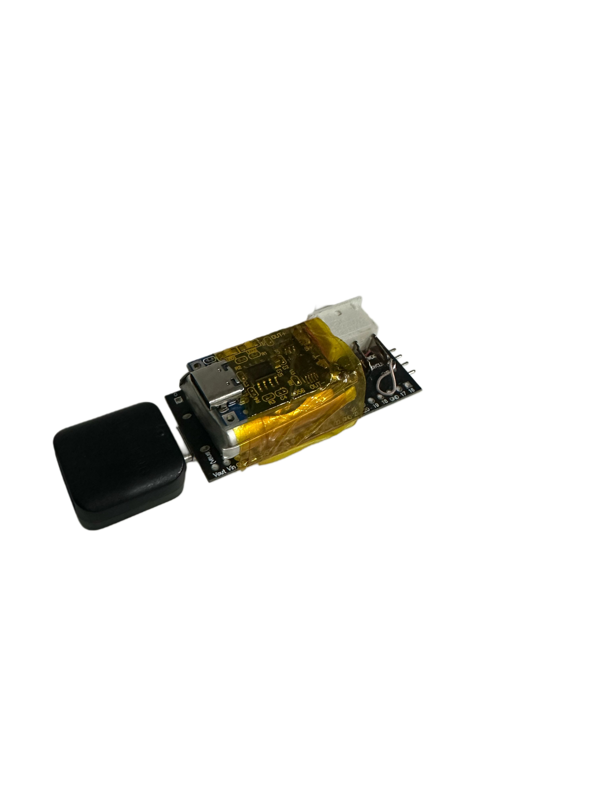
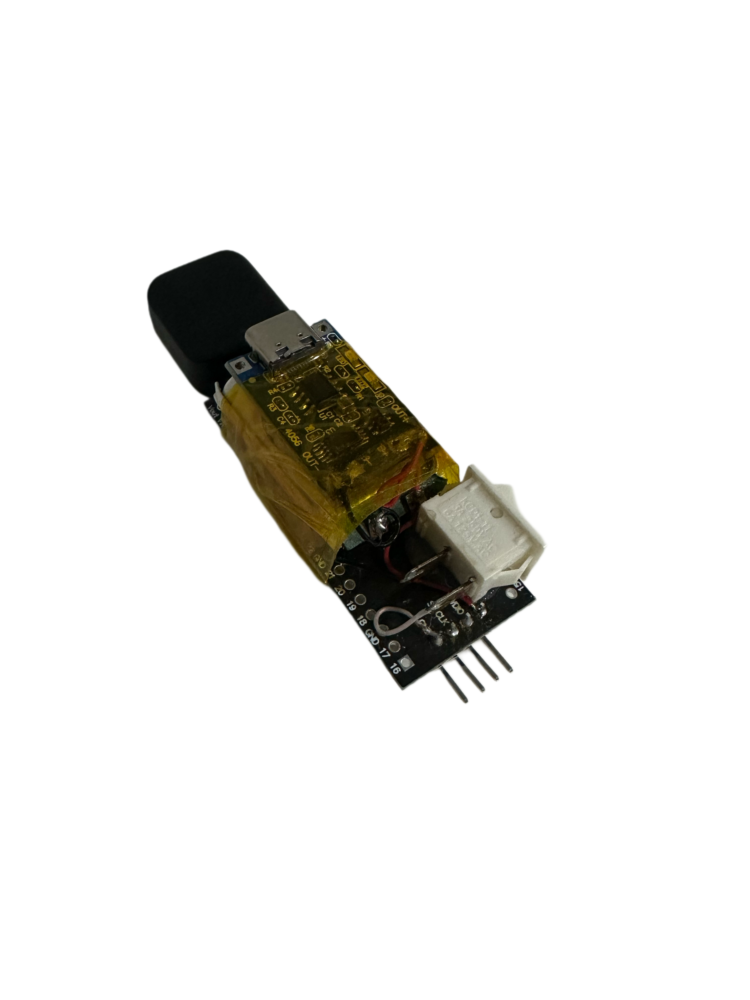
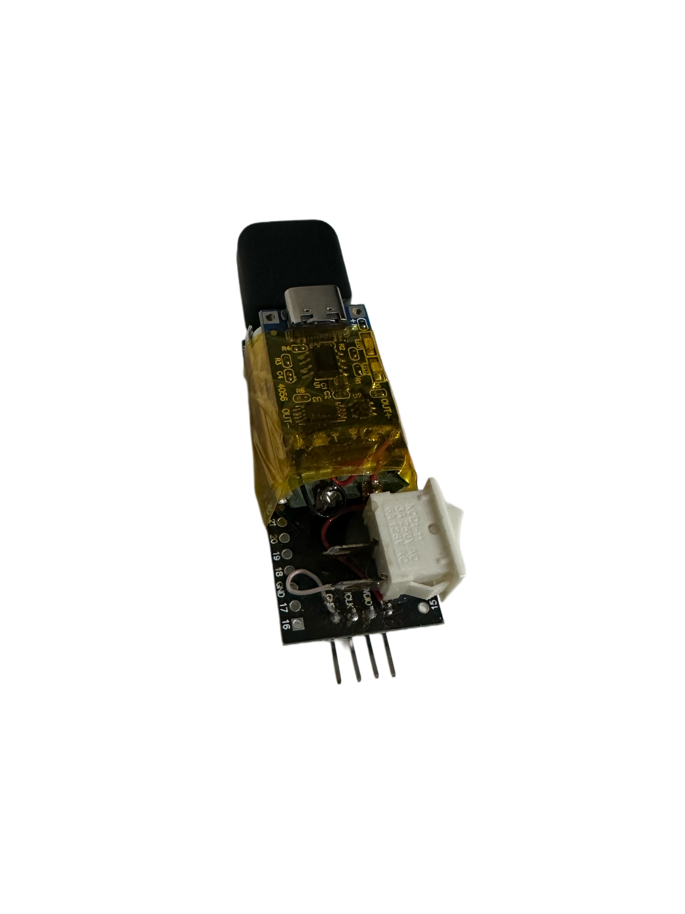

# Raspberry Pi Pico Checkm8 Mod


[](https://github.com/SmartMaster35Rus)

---

## Содержание

- [Описание](#описание)
- [Особенности](#особенности)
- [Возможности](#возможности)
- [Требования](#требования)
- [Установка](#установка)
- [Использование](#использование)
- [Схема подключения](#схема-подключения)
- [Важные замечания](#важные-замечания)
- [Вклад](#вклад)
- [Лицензия](#лицензия)
- [Контакты](#контакты)

---

## Описание

**Raspberry Pi Pico Checkm8 Mod** — проект на базе микроконтроллера Raspberry Pi Pico для эксплуатации уязвимости [Checkm8](https://checkm8.re) в устройствах Apple с чипом A5 (модели 8940, 8942, 8945). Инструмент переводит устройство в режим DFU, затем активирует режим PWNDFU для последующего джейлбрейка или восстановления.

---

## Особенности

- **Поддержка чипов Apple A5**: Совместимость с iPhone 4S, iPad 2 и другими устройствами на базе A5.
- **Простота использования**: Минимальные требования к опыту в электронике.
- **Готовые прошивки**: Три файла `.uf2` для разных моделей.
- **Открытый исходный код**: Лёгкая доработка и адаптация.
- **Аппаратный интерфейс**: Светодиоды и кнопки для индикации и управления.
- **Массовое программирование**: Одновременная поддержка нескольких устройств.

---

## Возможности

- Перевод устройств Apple A5 в режим DFU.
- Активация уязвимости Checkm8 и режима PWNDFU.
- Массовое программирование и обработка нескольких устройств.
- Светодиодная индикация хода процесса.

---

## Требования

### Аппаратное обеспечение

- Raspberry Pi Pico или совместимый микроконтроллер на базе RP2040.
- Провода для подключения к устройству Apple.
- Макетная плата (по желанию) для сборки.
- Переходник USB Type-C ↔ USB-A (или кабель).
- Обычный USB-кабель Apple для подключения устройства.

### Программное обеспечение

- [Компилятор C/C++](https://www.gnu.org/software/gcc/) (рекомендуется GCC).
- [SDK для Raspberry Pi Pico](https://github.com/raspberrypi/pico-sdk).
- [Visual Studio Code](https://code.visualstudio.com/) с необходимыми расширениями.

---

## Установка

### 1. Скачайте прошивки

В репозитории находятся файлы прошивок `.uf2` для различных моделей устройств Apple A5:

- `8940.uf2` — iPad 2, iPad mini (A5 8940)
- `8942.uf2` — iPhone 4S, iPod touch 5 (A5 8942)
- `8945.uf2` — Apple TV 3, iPad 3 (A5 8945)

### 2. Загрузка прошивки на Raspberry Pi Pico

1. **Подключение Pico**:
   - Подключите Raspberry Pi Pico к компьютеру, удерживая кнопку BOOTSEL, чтоб перевести его в режим загрузки.
2. **Копирование прошивки**:
   - Смонтируется новое устройство `RPI-RP2`.
   - Скопируйте нужный `.uf2` файл в корень устройства.

   ```bash
   # Пример для macOS/Linux:
   cp path/to/8940.uf2 /Volumes/RPI-RP2/
   ```

3. **Перезагрузка**:
   - После копирования файл Pico автоматически перезапустится.

---

## Использование

1. **Подключите устройство Apple A5**:
   - Подключите Pico к устройству Apple с помощью переходника USB Type-C ↔ USB-A и штатного USB-кабеля Apple.
   - При необходимости — соедините контакты GPIO по схеме (см. [Схема подключения](#схема-подключения)).

2. **Запуск процесса**:
   - Включите устройство Apple A5 и переведите в режим DFU.
   - Нажмите кнопку на Raspberry Pi Pico для старта.
   - Светодиоды на Pico покажут ход выполнения (быстрое мигание — работа, медленное — успешное завершение).

3. **Проверка**:
   - После перехода в режим PWNDFU можно приступать к дальнейшим операциям: джейлбрейк, восстановление и т.д.

---

## Схема подключения

**Внимание**: Необходима точность подключения!  
Используйте штатный USB-кабель и переходник USB Type-C ↔ USB-A.

**Пример схемы подключения:**
1. Вставьте переходник в порт USB Type-C на Raspberry Pi Pico.
2. Подключите к переходнику ваш стандартный USB-кабель Apple.
3. Другой конец — в устройство Apple A5, переведённое в DFU.

**Платформа полностью работает через штатные USB-разъёмы. При необходимости подключения GPIO — смотрите отдельную схему:**

<p align="center">
  
  
  
</p>

*(Cхема GPIO-подключения будет добавлена в репозиторий по мере готовности.)*

---

## Важные замечания

- **Безопасность**: Использование утилиты может привести к потере гарантии и/или повреждению устройства. Всё делаете на свой страх и риск.
- **Совместимость**: Перед началом работы проверьте, что устройство Apple поддерживается и выбран правильный файл прошивки.
- **Легальность**: Убедитесь, что джейлбрейк и модификация устройств разрешены законодательством вашей страны.

---

## Вклад

Любые улучшения приветствуются! Нашли ошибку, баг или хотите предложить доработку — создайте [issue](https://github.com/SmartMaster35Rus/Raspberry-Pi-Pico-Checkm8-Mod/issues) или отправьте [pull request](https://github.com/SmartMaster35Rus/Raspberry-Pi-Pico-Checkm8-Mod/pulls).

---

## Лицензия

Проект распространяется под лицензией [MIT](./LICENSE).

---

## Контакты

Если есть вопросы или предложения, пишите на [smartmaster35rus@yandex.ru](mailto:smartmaster35rus@yandex.ru)  
или через [GitHub Discussions](https://github.com/SmartMaster35Rus/Raspberry-Pi-Pico-Checkm8-Mod/discussions).

